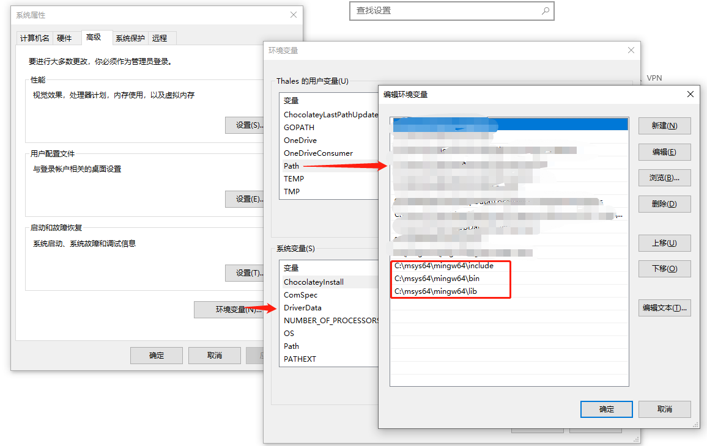

# GTK


开发GUI软件


## Linux
 

GTK是linux的常用软件开发库，**Linux**环境很好搭建


- Fedora

```bash
sudo dnf install gtk4-devel gcc
```


- Debian

```bash
sudo apt install libgtk-4-dev build-essential
```


- Arch


```bash
sudo pacman -S gtk4 base-devel
```


## macOs


苹果操作系统，需要先安装`brew`


https://brew.sh/


然后用`brew`安装`gtk`


```bash
brew install gtk4
```


## windows


windows相对比较麻烦


有`MSVC`和`GNu`两种


1. MSYS2


下载并安装msys2


https://www.msys2.org/


2. 安装GTK


使用`MSYS2`安装`GTK`


```bash
pacman -S mingw-w64-x86_64-gtk4 mingw-w64-x86_64-pkgconf mingw-w64-x86_64-gcc
```


3. 设置环境变量


```ini
C:\msys64\mingw64\include
C:\msys64\mingw64\bin
C:\msys64\mingw64\lib
```





4. `rust`安装`GNU toolchain`


```bash
rustup toolchain install stable-gnu
```


5. 切换


默认的是**stable-msvc**，需要切换成**stable-gnu**

```
rustup default stable-gnu
```