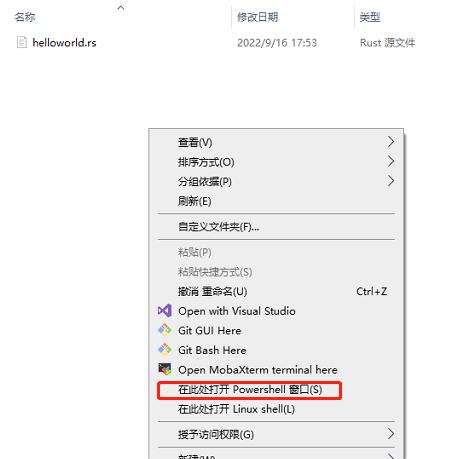

# Hello World


各大程序，学习的第一课基本都是输出一个*hello world*，本文也不例外


## 工作开始


1. 创建一个文件**helloworld.rs**
> **rs**为rust文件的后缀


```rust
fn main() {
  println!("Hello, world!");
}
```

2. 编译(compile)
> **Rust**不是**Python**和**JavaScript**那样的脚本语言，它类似 **C/C++** 那样的编译语言
> 编译语言需要先编译成**可执行文件**再执行，一般不能像脚本语言那样直接执行


在终端(terminal)输入


```bash
rustc helloworld.rs
```

> 不管window或者mac还是ubuntu系统，一般都是在文件所在目录右键就可以在当前位置打开终端





- **unix**操作系统会生成*helloworld*文件，执行可以输出刚才程序中写的“Hello, world!”
```bash
$ rustc helloworld.rs
$ ./helloworld
Hello, world!
```


- **windows**操作系统会生成*helloworld.exe*文件，执行可以输出刚才程序中写的“Hello, world!”
```shell
> rustc helloworld.rs
> .\helloworld.exe
Hello, world!
```